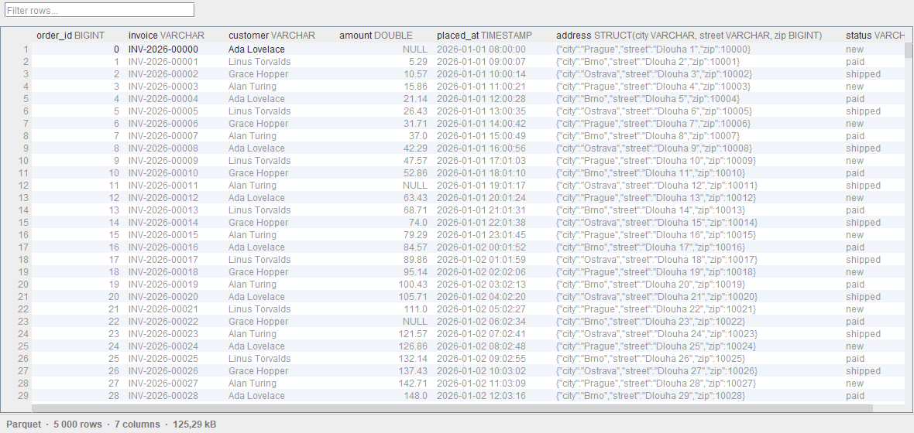
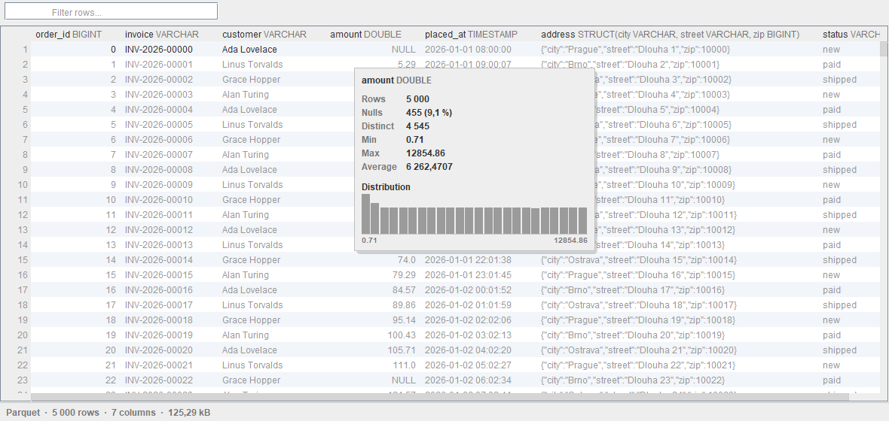
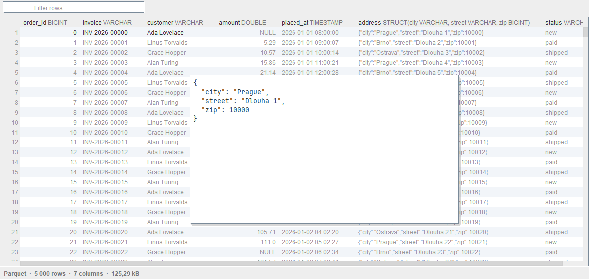
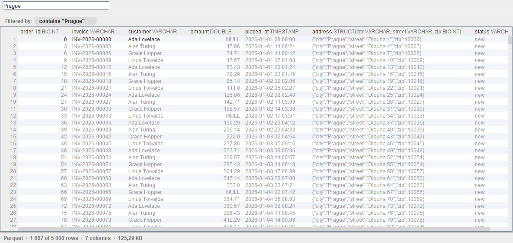
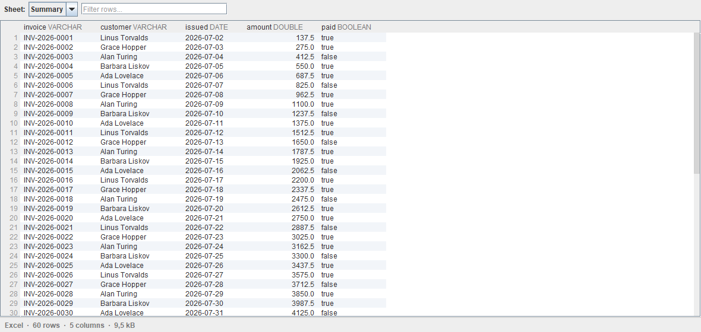

# TableKit: Excel & Parquet Viewer

Open Parquet, Excel, CSV, TSV and JSON Lines files directly in a JetBrains IDE - no row
limits, no freezes, no data leaving the machine.



An embedded DuckDB engine queries the file where it lies, so only the rows on screen are
ever in memory. A 1.2 GB Parquet file with 25 million rows opens in **17 ms** and stays
under **40 MB of heap** while it is sorted; a 786 MB CSV opens in under a second.

| | |
|---|---|
| **Every row** | No 10 000 row ceiling. Sorting and filtering become SQL against the file, never a sort in the IDE's heap. |
| **Every type** | Column types sit in the header; struct, list and map values are rendered as JSON instead of driver objects. |
| **Statistics** | Nulls, distinct values, range, average and the shape of the distribution, for the rows the filters leave. |
| **Excel** | `.xlsx` and `.xlsm`, sheet by sheet, with dates read as dates. |
| **Export** | The rows currently shown, filters and sorting included, to CSV, TSV, JSON Lines or Parquet - which also makes it a format converter. |
| **Private** | No network permissions at all. Nothing uploaded, no telemetry, nothing downloaded at runtime. |

<table>
<tr>
<td width="50%"></td>
<td width="50%"></td>
</tr>
<tr>
<td></td>
<td></td>
</tr>
</table>

Pictures are generated by `ScreenshotsTest`; colours come from the headless test look and
feel rather than a real IDE theme.

---

Vendor: **Kitworks** · Plugin ID: `com.kitworks.tablekit` (immutable after first upload)

## Status

Phase 2. The viewer works for Parquet, CSV, TSV, JSON Lines and Excel, with sorting,
filtering, column statistics, export and the interaction pass that makes it feel like part
of the IDE. See [PLAN.md](PLAN.md) for the roadmap, [CHANGELOG.md](CHANGELOG.md) for what
landed, and [CLAUDE.md](CLAUDE.md) for the product decisions behind it.

## Requirements

| | |
|---|---|
| JDK | 21 (IntelliJ Platform 2024.2 targets Java 21) |
| Gradle | 9.3.0 via the committed wrapper |
| Kotlin | 2.3.21, compiled with `apiVersion=1.9` (2024.2 bundles stdlib 1.9.24) |
| Target IDE | IntelliJ IDEA Community 2024.2.6, `sinceBuild=242`, no `untilBuild` |

The build never depends on IntelliJ Ultimate or on the Kotlin plugin.

## Build

```bash
./gradlew buildPlugin     # distribution zip in build/distributions
./gradlew runIde          # sandbox IDE with the plugin installed
./gradlew test            # unit tests
./gradlew verifyPlugin    # IntelliJ Plugin Verifier against recommended IDEs
```

Two suites are opt in because of what they produce:

```bash
./gradlew test -Ptablekit.perf=true --tests '*PerformanceTest'
./gradlew test -Ptablekit.screenshots=true --tests '*GridScreenshotTest'
```

The first generates a 1.2 GB Parquet file under `testData/generated` (kept between runs)
and asserts the performance targets. The second paints the editor into
`build/screenshots` without starting an IDE.

On Windows, `JAVA_HOME` must point at a JDK 21 installation
(`C:\Program Files\Microsoft\jdk-21.0.12.8-hotspot` on the dev machine).

## Architecture

```
FileEditorProvider (custom editor, NOT the IDE Document model - it caps at ~20 MB)
 ├─ BinaryTabularFileEditorProvider   parquet/xlsx/avro/orc -> HIDE_DEFAULT_EDITOR
 └─ TextTabularFileEditorProvider     csv/tsv/jsonl         -> PLACE_AFTER_DEFAULT_EDITOR
        └─ TabularFileEditor -> TabularEditorPanel (toolbar, grid, status bar)
              └─ TabularTableModel   40 pages x 200 rows, LRU, async fetch
                    └─ TableSource   one DuckDB session per open file
                          ├─ parquet/csv/tsv/jsonl  read in place
                          └─ xlsx     own reader -> temp table -> typed view
```

Sorting, filtering and statistics are pushed down to DuckDB as SQL; the grid never holds
more than a few thousand rows. One background thread per open file runs every query, and
the EDT only paints what has already arrived.

### Why the .xlsx reader is ours

Every Excel library worth using depends on `commons-compress` and a StAX implementation,
both of which the IntelliJ Platform already bundles in versions we do not control.
Shipping a second copy is how plugins earn `NoSuchMethodError` reports on IDE versions
their author never tested. `XlsxWorkbook` therefore parses the format with `java.util.zip`
and the `javax.xml.stream` API only. Apache POI is used in tests to write the fixtures it
is checked against, and is never shipped.

### Non-negotiable constraints

- **No network permissions.** No telemetry, no runtime downloads, nothing uploaded.
  It is both a selling point and a faster Marketplace review.
- **Never block the EDT.** Freezing IDEs is the category flaw we are here to fix.
- **Performance targets are requirements:** 1 GB Parquet open < 2 s, smooth scrolling,
  heap < 300 MB.
- **Never claim `.csv`/`.tsv`/`.jsonl` as the default editor** - we only add a tab next to
  the existing one.

## Layout

```
src/main/kotlin/com/kitworks/tablekit/
  format/     TabularFormat - supported formats and extension mapping
  filetype/   IDE file type registrations (drives plugin suggestions)
  data/       TableSource, queries, filters, DuckDB session
  data/xlsx/  the .xlsx reader
  editor/     FileEditor, providers, grid model, renderers, root panel
  icons/      icon holder
src/main/resources/
  META-INF/plugin.xml   plugin descriptor (id, name, vendor, extensions)
  messages/             i18n bundle
  icons/                file type icons
```

## Release

See [MARKETPLACE-SETUP.md](MARKETPLACE-SETUP.md). Signing and publishing credentials are read
from the environment only (`CERTIFICATE_CHAIN_FILE`, `PRIVATE_KEY_FILE`,
`PRIVATE_KEY_PASSWORD`, `PUBLISH_TOKEN`) and must never be committed.
